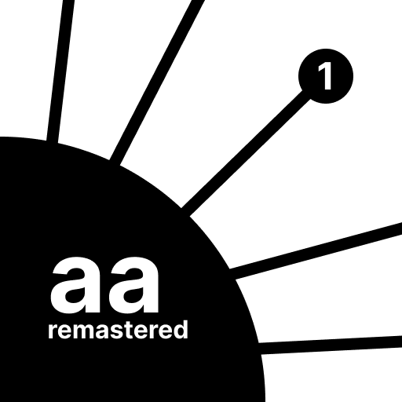

# AA

An implementation of the well-known AA game.

We originally developed this replica of the original game using java as uni project. Then we rewrote it for android with kotlin as another uni project. 😁

We do hope to improve on the current codebase and perhaps implement the game for other platforms.

## Supported Platforms

| Platform | Is Supported | minimum version |
| -------- | ------------ | --------------- |
| Android  | ✅ supported | 7               |
| iOS      | ❎ not yet   | -               |
| Windows  | ❎ not yet   | -               |
| macOS    | ❎ not yet   | -               |
| Linux    | ❎ not yet   | -               |

## Contributors

- [Arman Rostami](https://github.com/Rostamborn)
- [Armin Jodat](https://github.com/ar1381)
- [Danial Azimi](https://github.com/danilazm)
- [Dunyal Rasouli](https://github.com/duniyalr)
- [Joseph Osanlo](https://github.com/josephosan)
- [Mahbod Ghadiri Sani](https://github.com/MahbodGhadiri)
